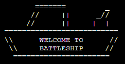
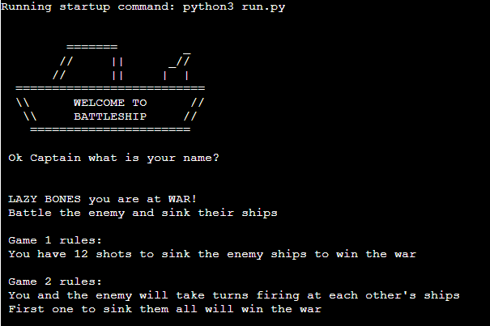
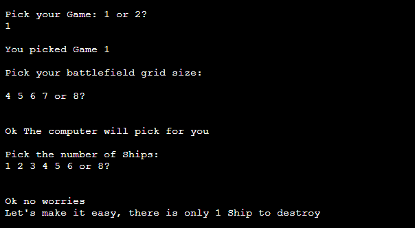
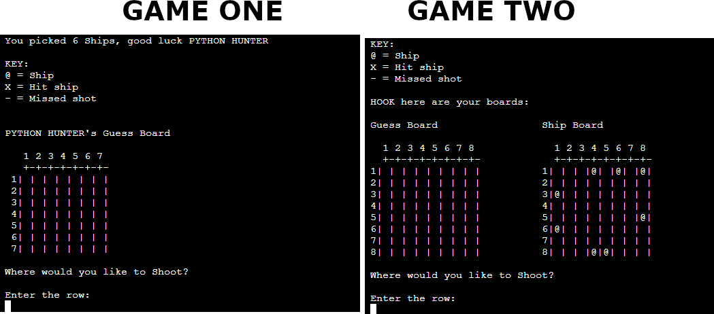
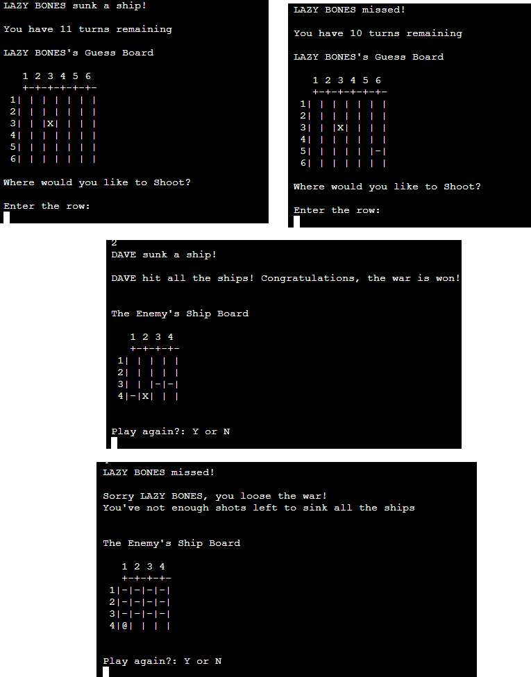
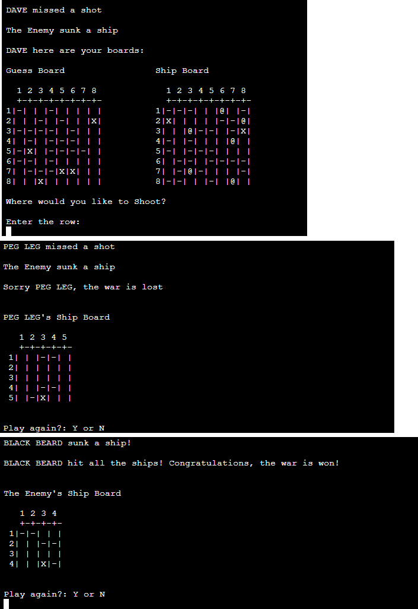
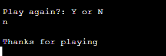
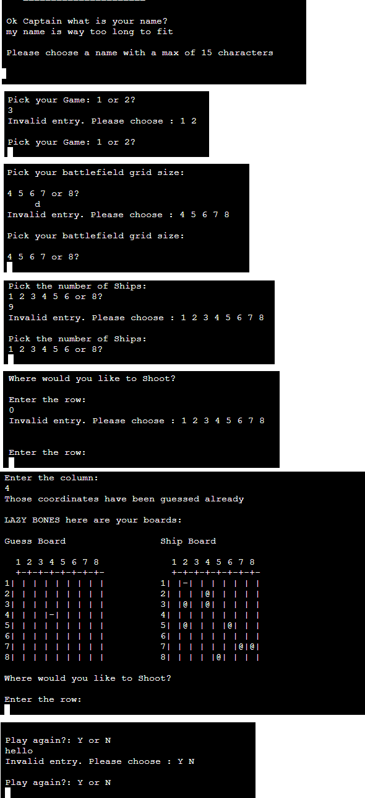

# Battleship!  
This is a computerised variation of the classic board game Battleship.  
You attempt to win the war by sinking all the enemy's ships, More information about the history of the game can be found here on [Wikipedia](https://en.wikipedia.org/wiki/Battleship_(game)).  
This version of the game lets you choose battlefield grid size, amount of ships and provides you the choice of two game types.

Visit the deployed site: [Battleship](https://battleship-ddocksey.herokuapp.com/)

## CONTENTS

* [Planning](#planning)
  * [User Stories](#user-stories)
  * [Design](#design)
  * [Flowcharts](#flowcharts)

* [Features](#features)
  * [Name Input and Rules](#name-input-and-rules)
  * [Game Choices](#game-choices)
  * [Start of Game](#start-of-game)
  * [Game One](#game-one)
  * [Game Two](#game-two)
  * [Play Again?](#play-again)
  * [Validate Inputs](#validate-inputs)
  * [Languages Used](#languages-used)
  * [Future Implementations](#future-implementations)
  * [Data Model](#data-model)

* [Deployment](#deployment)
* [Testing](#testing)
* [Credits](#credits)

## Planning

### User Stories  
#### User goals
* As a user I want to clearly know what I am doing.
* As a user I want to play a game against a computer to see if I come out on top. 
* As a returning user I would like to play again and show my friends.

#### The websites goals
* As the site owner I want to entertain the user.
* As the site owner I would like to provide a game that is easy to understand.
* As the site owner I would like all user inputs to provide feedback and let the game continue.
* As the site owner I would like to encourage the user to play more than once and return to the site.

#### How will the goals be acheived  
* Instructions on how to play the game will be provided to make it easy to understand.
* Added options of picking battlefield grid size, ships and game type will provided added entertainment and encourage the user to return.
* On every input there will be a loop until valid input is given, with feedback given if invalid input is entered.

### Flowcharts  

I created three flowcharts. One  to show the running of the whole game and one each for the different game types:

  

  

  

## Design  
This game is based inside a mock terminal deployed via Heroku and has basic design. I have added a welcome image using ASCII art.

## Features  

### Name Input and Rules  
Here a welcome message is displayed and the user is asked for their name. 
If [valid](#validate-inputs) it will be displayed along with the rules of the two different games avaliable.  
If the user gives a blank input the name LAZY BONES will be given.  

### Game Choices  
This asks the user to choose game type 1 or 2, battlefield grid size and amount of ships on the board.  
There are two game type choices, the grid can be 4-8 squared  and 1-8 ships can be picked.  
Each choice is checked if it is a [Valid input](#validate-inputs) then the game wil start.  
If the user gives a blank input for grid size a random size will be given.  
A blank input for ship number gives just one ship.  
The user will be informed of what choice they have made or been given.  
See below for choices given and what happens if you leave grid and ship choice blank.  

### Start of Game   
Before the guessing starts the Key for the game is displayed along with relevent boards for the chosen game.  
Game one prints just the user guess board, game two prints the user guess and ship board.  
See below for examples.  

### Game One   
The user has 12 shots to sink the computers ships on their board.  
The user enters their coordinate guess which is then checked if it is [valid](#validate-inputs) or guessed before, if so they will be asked to guess again.   
If it is a valid guess the computer board is then checked if the shot is a hit of a miss and the relevant x or - is marked on the user guess board and computer board. A message to user informing them if they hit or missed will be displayed.  
The remaining ships left on the computers board will then be counted and if there are none left the winning message along with the computer board will be displayed and the user will be given the option to play again.  
If there are ships remaining it will be checked if the user has enough shots left to win. If there are not enough shots a looser message and computer board will be displayed and an option to play agin given.  
If the user has enough shots they will take another shot.  
See below examples of game one with hit/miss/winner and looser messages.  

### Game Two  
The user then computer take turns to shoot to see who sinks each others ships first.  
The user enters their coordinates guess whick is checked if it is [valid](#validate-inputs) or guessed before, if so they will be asked to guess again.  
If the shot is a hit or miss the relevant X or - is marked on the user guess board and computer ship board and a sutable message to the user is displayed.  
The remaining computer ships are then counted and if there are none left the winner message and computer ship board will be displayed along with an option to play again.  
If there are ships remaining its the computers shot which generates a random coordinate guess. This guess is then marked on their guess board and user ship board with relevent message displyed.  
The remaining ships are then checked on the user ship board, if none left the looser message and user ship board will be displayed and again the option given to play again.  
If there are ships still remaining it goes back to the users shot.  
See below example images of game two with hits/misses/ winning and loosing messages.  

### Play Again  
After the game is won or lost the user will ne given an option to play again or end game by inputting Y or N.  
This input will be checked if [valid](#validate-inputs), if Y is picked the whole game will run again and if N picked a thanks for playing message will be displayed and game will end.

### Validate Inputs  
All inputs are checked if they are valid. A function was created to check if the input given is within valid input choices allowed.  
All inputs have their whitespace either sides removed incase of keyboard error. All strings are turned into uppercase for the same reason.  
For the user name input I have chosen to limit it to 15 characters to maintain screen readability. I allowed the user to use numbers and symbols, except whitespace at the start because this does not look right during the game.  
If the user enters nothing/blank  for the battlefield grid choice they are given a random size.  
If the user enters nothing/blank for the ship number choice they are given only one ship.  
All of the inputs have been thoroughly tested and documented in the [TESTING.md](TESTING.md)
See below for examples of invalid input messages.  

### Languages Used  
Python

### Future Implementations  
* Add the option for the user to place their ships.
* Add a variation of ship sizes.
* Create a multiplayer game where two humans take turns.

## Data Model  
I chose to create three classes for this game:  

1. Player Class
* This creates instances for the players. With attributes of name, size of battlefield grid and amount of ships.
* The methods in this class names the player, allows the player to choose battlefield grid size and amount of ships.
* In this game a user instance and a computer instance are created for each time you play. The user is created once you enter your name.  

2. GameBoards Class:
* This creates instances for each board required. With attributes of the player (created in the Player class) and board type.
* The methods in this class are printing one or two boards, creating ships on the board, getting the players shot coordinates and counting remaining ships on the board.
* In this game four boards are created. A ship board and a guess board for both the user and computer.

3. GameType class:
* This creates an instance for each type of game. With attributes of amount of turns, each player created and each board created.
* The methods in this class are game type one and game type two, running the relevant game chosen by the user.

## Deployment  
The steps to deploy using [Heroku](https://id.heroku.com/login): 
* Select new in the top right corner of the dashboard and create new app on dropdown menu.
* Name the app and choose region and select create app.
* In the created app's settings click reveal Config Vars and set value to PORT and KEY to 8000 and select add.
* This app did not require any other Config Variables to add.
* Below Config Vars select Add Buildpack and select Python and then Node.js making sure the two are in that order.
* Go to deploy section and choose github as deployment method, this will connect to github then connect the correct repository.
* Then you can either select Automatic deploy or deploy manually and click deploy branch.
* The app will then be deployed.
* This game had no additional dependincies that needed to be added to the requirements.txt file but if it did you'd need to type into the terminal pip3 freeze requirements.txt to update it.

To Fork the repository:  
* In Github go to the repository [https://github.com/DavidDock/Battleship](https://github.com/DavidDock/Battleship).
* Click the fork button in the top right corner.  

To Clone the repository:  
* In Github go to the repository [https://github.com/DavidDock/Battleship](https://github.com/DavidDock/Battleship).
*  Click the Code button and select if you'd like to clone with HTTPS, SSH or Github CLI and copy the link underneath.
* Open your terminal in your code editor and change the working directory to the location you want to use for the cloned directory.
* Type 'git clone', paste the link you copied and press enter.
* If using the code institute template there will be no need to set up the virtual environment.
## Testing
Please refer to [TESTING.MD](TESTING.md)  

## Credits
### Learning  
The code used for this project was taught to me by code insitute. Code Insitutes project run through 'love sandwiches' helped me greatly with the concepts needed in my project including deploying the site with Heroku and creating a seperate function to validate data. Code insitutes scope video for battleship also helped me understand the concept of building the game and the use of classes.

### New learning

To gain a greater understanding I also watched Knowledge Mavens Battleship tutorial videos, [How to Code Battleship in Python](https://www.youtube.com/watch?v=tF1WRCrd_HQ) and [Python Battleship with Object Oriented Programming](https://www.youtube.com/watch?v=alJH_c9t4zw). I found it really helped me understand each function required. It particularly helped with the method I used to print the board, further learnt on [Stackoverflow](https://stackoverflow.com/questions/4288973/whats-the-difference-between-s-and-d-in-python-string-formatting).
I also found [Stackoverflow](https://stackoverflow.com/questions/23623288/print-full-ascii-art) useful for creating my welcome message.  
As per my mentors advice I learnt about best practices on writing Docstrings from [https://www.geeksforgeeks.org/python-docstrings/](https://www.geeksforgeeks.org/python-docstrings/) and implemented this learning into my Docstring writing.

## Content and Media  

* My flowcharts were made using [lucid](https://lucid.app/).