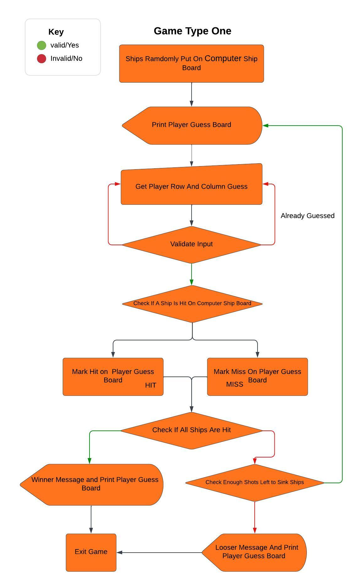

# Battleship!  
This is a computerised variation of the classic board game Battleship.  
You attempt to win the war by sinking all the enemy's ships, More information about the history of the game can be found here on [Wikipedia](https://en.wikipedia.org/wiki/Battleship_(game)).  
This version of the game lets you choose battlefield grid size, amount of ships and provides you the choice of two game types.

Visit the deployed site: [Battleship](https://battleship-ddocksey.herokuapp.com/)

## CONTENTS

* [Planning](#planning)
  * [User Stories](#user-stories)
  * [Design](#design)
  * [Flowcharts](#flowcharts)

* [Features](#features)
  * [Languages Used](#languages-used)
  * [Future Implementations](#future-implementations)
  * [Data Model](#data-model)

* [Deployment](#deployment)
* [Testing](#testing)
* [Credits](#credits)

## Planning

### User Stories  
#### User goals
* As a user I want to clearly know what I am doing.
* As a user I want to play a game against a computer to see if I come out on top. 
* As a returning user I would like to play again and show my friends.

#### The websites goals
* As the site owner I want to entertain the user.
* As the site owner I would like to provide a game that is easy to understand.
* As the site owner I would like all user inputs to provide feedback and let the game continue.
* As the site owner I would like to encourage the user to play more than once and return to the site.

#### How will the goals be acheived  
* Instructions on how to play the game will be provided to make it easy to understand.
* Added options of picking battlefield grid size, ships and game type will provided added entertainment and encourage the user to return.
* On every input there will be a loop until valid input is given, with feedback given if invalid input is entered.

### Flowcharts  

I created three flowcharts. One  to show the running of the whole game and one each for the different game types:

  

  

  

## Design  
This game is based inside a mock terminal deployed via Heroku and has basic design. I have added a welcome image using ASCII art.

## Features  

### Languages Used  
Python

### Future Implementations  
* Add the option for the user to place their ships.
* Add a variation of ship sizes.
* Create a multiplayer game where two humans take turns.

## Data Model  
I chose to create three classes for this game:  

1. Player Class
* This creates instances for the players. With attributes of name, size of battlefield grid and amount of ships.
* The methods in this class names the player, allows the player to choose battlefield grid size and amount of ships.
* In this game a user instance and a computer instance are created for each time you play. The user is created once you enter your name.  

2. GameBoards Class:
* This creates instances for each board required. With attributes of the player (created in the Player class) and board type.
* The methods in this class are printing one or two boards, creating ships on the board, getting the players shot coordinates and counting remaining ships on the board.
* In this game four boards are created. A ship board and a guess board for both the user and computer.

3. GameType class:
* This creates an instance for each type of game. With attributes of amount of turns, each player created and each board created.
* The methods in this class are game type one and game type two, running the relevant game chosen by the user.

## Deployment

## Testing
Please refer to [TESTING.MD](TESTING.md)  

## Credits