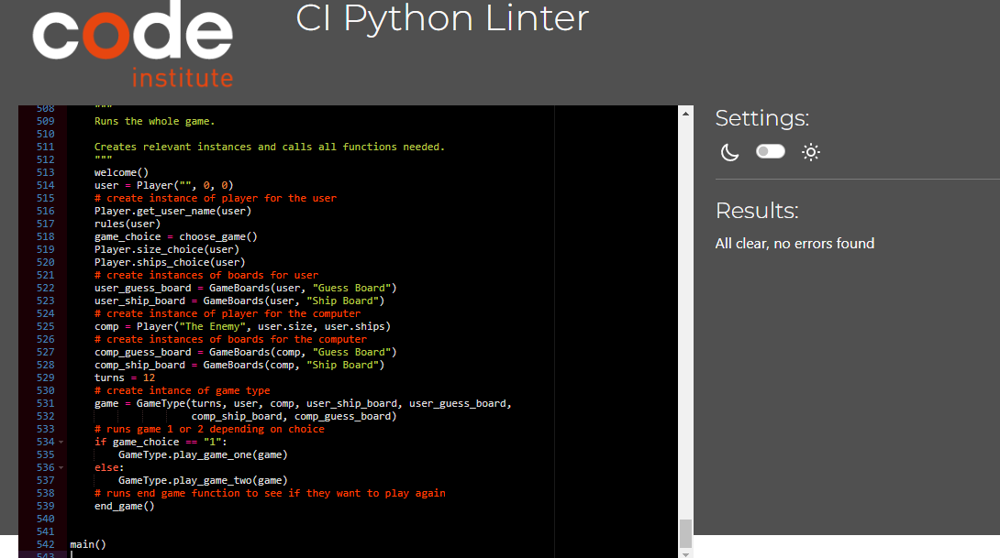

## CONTENTS

* [PEP8 Linter](#pep-8)
* [General Bugs and Fixes Throughout Development](#general-bugs-and-fixes-throughout-development)
* [Manual Testing](#manual-testing)
* [User Story Tests](#user-story-tests) 

## PEP 8  

I used [CI Python Linter](https://pep8ci.herokuapp.com/) throughout development to make sure there were no problems and issues could be fixed along the way. My code did have a number of lines above 79 characters mainly due to long variable names but I managed to split the lines using backslashes and indentation when required.

### Final Test Results

  

## General Bugs and Fixes Throughout Development  

Each function caused new issues to solve which were fixed by using print statements throughout and reading error messages.  
These included indentation errors in game one and game two loops which were fixed through careful inspection.  
Another challenge for me came with the use of strings and integers in my different choices and validating the data given. I had to use a string for data input and lists of valid data but in some cases return integer values, this took a little time working out.

## Manual Testing  

I have tested the site using the Heroku app created and also in my local terminal throughout development.

I undertook the following manual tests:   

| Feature | Expected Outcome | Test Performed | Result | Pass/Bug fixed |  
| --- | --- | --- | --- | --- |  
| Name Input | Displays Name Entered. Displays LAZY BONES if empty string or nothing is entered. Displays error message if more than 15 characters is entered and asks to re-enter.| Stress tested with too many characters, blank space and no name. | Correct invalid message or name displayed. Although if white space infront or after input it does not look very good. Another issue was that you can choose the same name as the computer. | I changed the get_user_name method to account for a duplicate name being created. I then re ran stress tests to make sure everything still worked correctly. I aso added .strip() to improve. - Fixed.
| Displays Rules | Displays rules with correct name. | Enterd different and no names. | All expected outcome | Pass
| Pick Game 1 or 2 | Displays  correct game number picked message. Displays error message if 1 or 2 is not entered and asks to re-enter. Correct game starts. | Stress tested with letters, invalid numbers, blank space and no entry. Checked if correct game runs if either 1 or 2 is chosen. | Correct game runs. Correct message given if valid or invalid entry given. Allthough if blank space is infront or after a valid entry I feel it should be valid. | Added .strip() to improve - Fixed.
| Pick Battlefield Grid Size | Displays  correct size picked message if valid. Displays error message if invalid input and asks to re-enter. If nothing is entered gives random size and informs user. Creates correct size grid. | Stress tested with letters, invalid numbers, blank space and no entry. Checked grid sizes when both valid choice made and random one given. | All correct messages displayed and size grid used. Allthough if blank space is infront or after a valid entry I feel it should be valid. | Added .strip() to improve - Fixed.
|  Pick Number of Ships |  Displays  correct ship amount picked message if valid. Displays error message if invalid input and asks to re-enter. If nothing is entered gives just 1 ship and informs user. Creates correct amount of ships. | Stress tested with letters, invalid numbers, blank space and no entry. Checked ship number when both valid choice made and just 1 ship given. | All correct messages displayed and ships given. Allthough if blank space is infront or after a valid entry I feel it should be valid. | Added .strip() to improve - Fixed.
| Displays Game with key and boards | Displays key, correct board/boards with name and also correct size and ships. | Tried different variations of games, ships, names and sizes. | Key for game one didn't feature @ for ships which is needed if user looses. All else correctly displayed. | Key changed. Fixed
| Validate Input Row and Column Game one and Two | If invalid display message and ask for another guess. If guessed already display message and ask for another guess. If valid move on with game. | Played multiple times entering invalid numbers and letters and same coordinates. | Correct message displyed and outcome reached. Allthough if blank space is infront or after a valid entry I feel it should be valid. | Added .strip() to improve - Fixed. |
| Game One Valid Coordinate Guessed | Correct HIT or MISS message given and marked on board correctly. Turns left message decreases by 1. Guess board prints again unless end result is reached and new guess asked for. | Played lots of times also with player 2 ship board printed too so I could see where ships were and HITS/MISSES made. | Turns decreased correctly. All hits and misses correctly marked on boards and messages given. Board re-printed and new coordinates asked for. | Pass
| HIT all ships in Game One | Display sunk ship message. Display winning message. Print player two ship board. Ask if user wants to play again. | Played and won lots of times. | Correct outcome. | Pass |
| Run Out of Shots to Win in Game One| If there are not enough shots left to sink remaining ships: Display missed ship message. Display loosing message. Print player two ship board. Ask if user wants to play again. | Played and lost lots of times carefully taking notice of turns left and ships left to hit. | Correct outcome. | Pass |
| Choose to Play again | Display error message if invalid input entered and asks to re-enter. It should work with lower and uppercase entry. Either restarts game if Y chosen or gives a fairwell message and stops game if N is entered. | Stress tested with invalid letters,numbers, blank space and no entry. | Correct invalid message displayed and user asked to play again. Correct outcome achieved if valid input. Allthough if blank space is infront or after a valid entry I feel it should be valid. | Added .strip() to improve - Fixed. |
| Game Two Valid Coordinate Guessed | Correct HIT or MISS message given and marked on user guess board and player 2 ship board correctly. If all computer ships aren't sunk then Computer makes random guess which also displayes HIT or MISS message and marks their guess board and the users ship board and if Users ships aren't all sunk User boards print again and new coordinate guess should be asked for. | Played lots of times also with all boards printed too so I could see where ships were and HITS/MISSES made. | All HITS and MISSES correctly marked on boards and messages given . Boards re-printed and new coordinates asked for until a player won. | Pass
| User HIT all computer Ships Game Two | Display sunk ship message. Display winning message. Print player two ship board. Ask if user wants to play again. | Played and won lots of times. | Correct outcome. | Pass |
| Computer sunk all User Ships Game Two | Display sunk ship message. Display loosing message. Print user ship board. Ask if user wants to play again. | Played and lost lots of times. | Correct outcome. | Pass |  

## User Story Tests
* As a user I want to clearly know what I am doing - All rules  are explained and the results of each input or action are displayed to the user through print statements.  
* As a user I want to play a game against a computer to see if I come out on top - Two game types to play against the computer function well.   
* As a returning user I would like to play again and show my friends - The user is given the option to play again after the game is complete and there are different options given to encourage return use.
* As the site owner I want to entertain the user - The user is given a good amount of options and should entertain.
* As the site owner I would like to provide a game that is easy to understand - clear instructions and print statements are displayed throughout to ensure the game is easy to understand.
* As the site owner I would like all user inputs to provide feedback and let the game continue - All invalid inputs have been accounted for and tested. The user is informed of their inputs at every stage.
* As the site owner I would like to encourage the user to play more than once and return to the site - With the play again option and multiple choices to change the game this encourages the user to return.