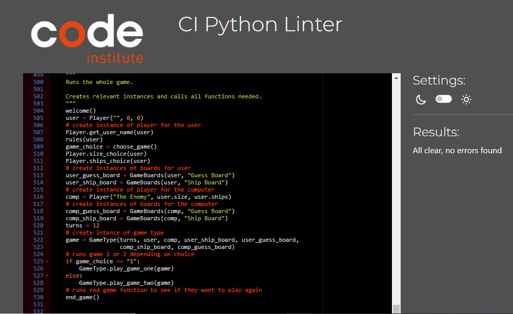

## CONTENTS

* [PEP8 Linter](#pep-8)
* [General Bugs and Fixes Throughout Development](#general-bugs-and-fixes-throughout-development)
* [Manual Testing](#manual-testing)  

## PEP 8  

I used [CI Python Linter](https://pep8ci.herokuapp.com/) throughout development to make sure there were no problems and issues could be fixed along the way. I did have quite a few lines above 79 characters mainly due to long variable names but I managed to split the lines using backslashes and indentation when required.

### Final Test Results

  

## General Bugs and Fixes Throughout Development  

Each function caused new issues to solve which were fixed by using print statements throughout and reading error messages. These included indentation errors in game one and game two loops which were fixed through careful inspection. 
Another challenge for me came with the use of strings and integers in my different choices and validating the data given. I had to use a string for data input and lists of valid data but in some cases return integer values, this took a little time working out.

## Manual Testing  

I have tested the site using the Heroku app created and also in my local terminal throughout development.

I undertook the following manual tests:   

| Feature | Expected Outcome | Test Performed | Result | Pass/Bug fixed |  
| --- | --- | --- | --- | --- |  
